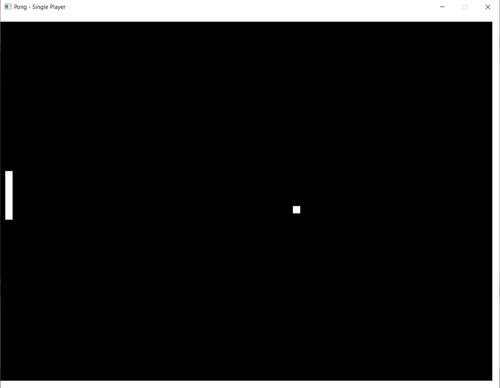
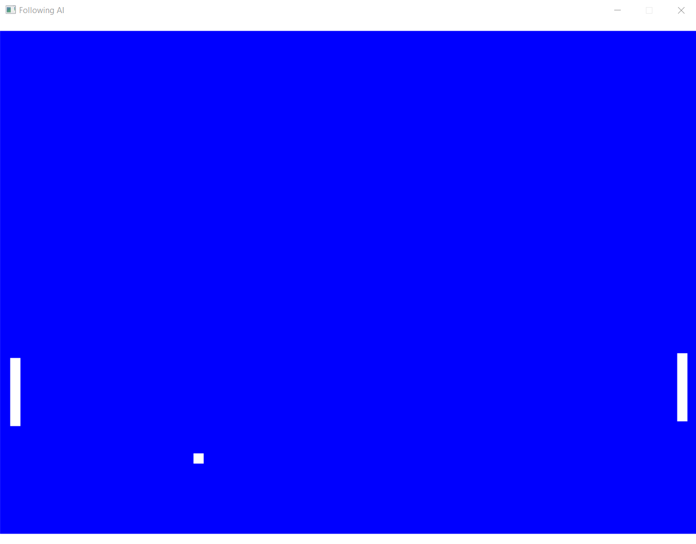

# Pong Ultima
A retro styled AI and multiplayer pong game.
## Description
Pong is considered as the debut to a programmer's journey into game development.
 One of the first video games that was developed, the fun factor of the game hasn't dimnished
a bit and gives even greater joy to the programmer.  
Here I've tried my hand at making single player, multiplayer as well as AI agent versions of the pong game.
## Versions
**Single Player -** A single player pong game where a player can hone the skills required to play pong  
**Multiplayer -** A multiplayer pong game where 2 opponents can find out who 's best  
**AI Agent -** Play against an AI agent and test whether you're better than your computer
## Tech Stack
The game was coded in C++ and uses the Simple DirectMedia Layer(SDL) library.
## Result

  

 